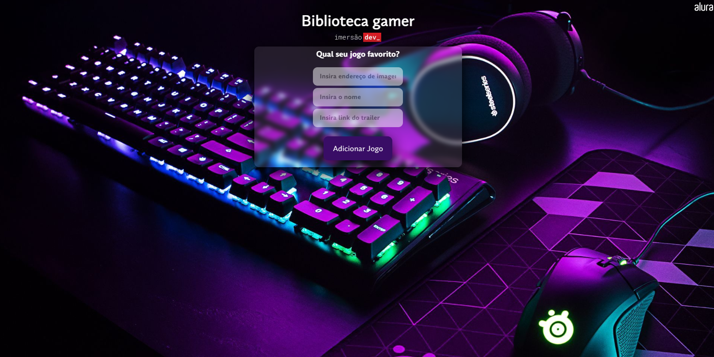
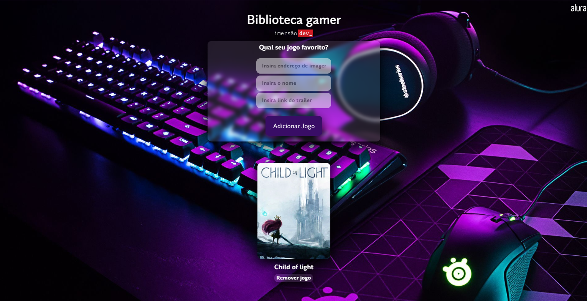

# Projeto biblioteca gamer
#### _Alura (Imersão Dev 2023)_

O projeto _biblioteca gamer_ foi desenvolvido na semana de imersão Dev 2023 e tivemos como base o material disponível no [CodePen](https://codepen.io/imersao-dev/pen/XWpWrod}) da Alura.

#### Alterações do projeto original
- Alterações visuais (HTML/CSS);
- Implementação dos scripts responsáveis por adicionar e remover a imagem, o link do trailer e o nome do jogo escolhido pelo usuário;

> [LinkedIn](https://www.linkedin.com/in/ana-carolina-lambertucci-simas/)
> [CodePen](https://codepen.io/anasimas/pen/XWBodKB)